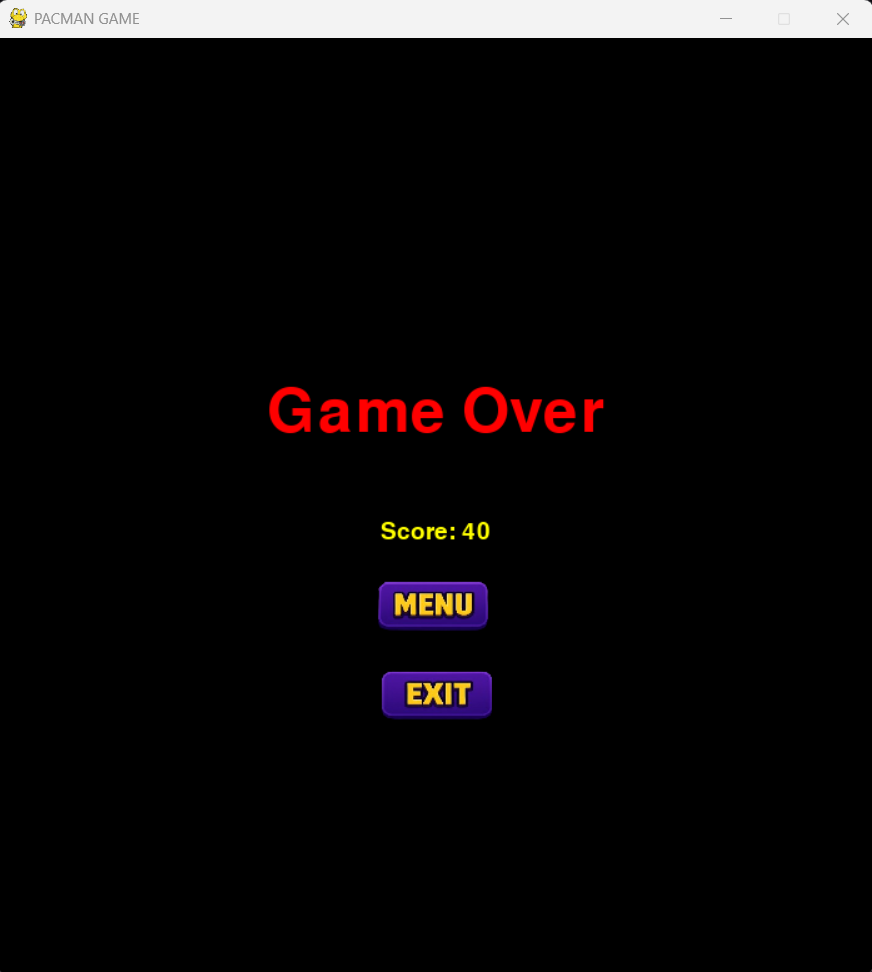

<h1 align="center"> DỰ ÁN TRÒ CHƠI PACMAN</h1>

**TỔNG QUAN**
- Dự án này là một phiên bản trò chơi Pac-Man cổ điển được viết bằng Python, phát triển như một dự án về trí tuệ nhân tạo (AI). Khác với phiên bản gốc, trò chơi này sử dụng các thuật toán tìm đường (pathfinding) để điều khiển các con ma (ghosts), bao gồm A*, Dijkstra, BFS và di chuyển ngẫu nhiên (Random). Ngoài ra, dự án còn phân tích hành vi của các con ma thông qua nhật ký (log) và trực quan hóa kết quả phân tích bằng biểu đồ.

**NGUỒN GỐC CỦA Pac-Man**

- Pac-Man là một trò chơi arcade được phát triển bởi công ty Namco và phát hành vào năm 1980. Tác giả của trò chơi, Toru Iwatani, đã thiết kế Pac-Man với mục tiêu tạo ra một trò chơi thu hút cả nam và nữ, thay vì các trò chơi bắn súng phổ biến vào thời điểm đó. Trò chơi nhanh chóng trở thành một biểu tượng trong văn hóa đại chúng, với lối chơi đơn giản nhưng gây nghiện. Pac-Man được coi là một trong những trò chơi điện tử có ảnh hưởng nhất mọi thời đại.

**TÍNH NĂNG CHÍNH**

- Gameplay Cổ Điển: Điều khiển Pac-Man thu thập chấm và power pellets, tránh 4 con ma (Blinky, Inky, Pinky, Clyde) để qua màn.
AI Điều Khiển Ma: Mỗi con ma sử dụng thuật toán tìm đường khác nhau:
- Blinky: A*
- Inky: Dijkstra
- Pinky: A* hoặc Random (50% cơ hội)
- Clyde: BFS
- Phân Tích Hành Vi Ma: Ghi lại di chuyển của ma, phân tích hiệu quả (số bước, đổi hướng, khoảng cách đến Pac-Man) và tạo biểu đồ trực quan.
- Hai Màn Chơi: Chơi qua 2 màn với bố cục bản đồ khác nhau, độ khó tăng dần.
- Hệ Thống Điểm Số: Thu thập chấm (10 điểm), power pellets (50 điểm), ăn ma trong chế độ power-up (200 điểm trở lên).
- Lưu Điểm Cao Nhất: Điểm cao nhất được lưu và hiển thị ở màn hình chính.
- Hiệu Ứng Âm Thanh và Hình Ảnh: Nhạc nền, âm thanh sự kiện (ăn chấm, ăn ma, thua cuộc), và hình ảnh tùy chỉnh.

**CÀI ĐẶT VÀ CHẠY TRÒ CHƠI**

**Yêu Cầu:**
- Python 3.6 trở lên
- Môi trường ảo (khuyến nghị sử dụng)

***
**HƯỚNG DẪN CÀI ĐẶT**

_1. TẢI DỰ ÁN_

Tải toàn bộ file dự án hoặc sao chép từ kho lưu trữ (repository) về máy của bạn.

_2. TẠO MÔI TRƯỜNG ẢO_
* **Bước 1:** Tạo môi trường ảo
  ````bash
  python -m venv venv
  ````
* **Bước 2:** Kích hoạt môi trường ảo
  * _**Trên Windows:**_
   ````bash
  venv\Scripts\activate
  ````
* _**Trên macOS và Linux:**_
  ````bash
  source venv/bin/activate
  ````
* **Bước 3:** Cài đặt các thư viện cần thiết
  ````bash
  pip install -r requirements.txt
  ````
_3.CÀI ĐẶT MÔI TRƯỜNG_
- Cài đặt các thư viện cần thiết được liệt kê trong file requirements.txt:
   ````bash
  pip install -r requirements.txt
  ````
**Dự án sử dụng các thư viện sau với phiên bản cụ thể:**
- pygame==2.6.1: Xây dựng giao diện và xử lý trò chơi.
- Pillow==11.1.0: Xử lý hình ảnh.
- matplotlib==3.10.1: Trực quan hóa dữ liệu phân tích hành vi ma.
- numpy==2.2.4: Xử lý số liệu (dùng trong phân tích).
- contourpy==1.3.2: Hỗ trợ vẽ biểu đồ cho matplotlib.
- cycler==0.12.1: Quản lý chu kỳ màu sắc trong biểu đồ matplotlib.
- fonttools==4.57.0: Xử lý font chữ cho matplotlib.
- kiwisolver==1.4.8: Xử lý layout cho matplotlib.
- pyparsing==3.2.3: Phân tích cú pháp cho matplotlib.
- python-dateutil==2.9.0.post0: Xử lý ngày giờ cho matplotlib.
- six==1.17.0: Hỗ trợ tương thích cho python-dateutil.

- Các thư viện chuẩn của Python: json, os, time, glob, sys, collections (defaultdict), queue (Queue), heapq, random.

_Nếu bạn gặp vấn đề về phiên bản, hãy đảm bảo cài đúng phiên bản như trên để tránh xung đột._

**4. CHẠY TRÒ CHƠI**

Khởi động trò chơi bằng cách chạy file chính:
  ````bash
  python main.py
  ````
**5. HƯỚNG DẪN TRÒ CHƠI**

**BẮT ĐẦU TRÒ CHƠI**

1. Chạy file main.py để khởi động trò chơi.
2. Trò chơi sẽ hiển thị màn hình tải (loading screen), sau đó chuyển sang màn hình chính (menu).
3. Nhấn nút "Play" để bắt đầu chơi ở màn 1.

**CÁCH ĐIỀU KHIỂN**

_1. Cách di chuyển_
- Phím Mũi Tên Phải / D: Di chuyển sang phải
- Phím Mũi Tên Trái / A: Di chuyển sang trái
- Phím Mũi Tên Lên / W: Di chuyển lên trên
- Phím Mũi Tên Xuống / S: Di chuyển xuống dưới

_2. Phím ESC:_ Thoát trò chơi bất kỳ lúc nào (sẽ lưu điểm cao nhất và nhật ký di chuyển của ma trước khi thoát).

**MỤC TIÊU**
- Thu Thập Chấm: Điều khiển Pac-Man đi qua các chấm nhỏ (pellets) để kiếm 10 điểm mỗi chấm và power pellets để kiếm 50 điểm.
- Tránh Ma: Có 4 con ma (Blinky, Inky, Pinky, Clyde) đuổi theo Pac-Man. Nếu va chạm với ma, bạn sẽ mất một mạng.
- Chế Độ Power-Up: Khi ăn power pellet, các con ma sẽ chuyển sang màu xanh trong một khoảng thời gian, cho phép Pac-Man ăn chúng để nhận điểm thưởng (200 điểm cho ma đầu tiên, tăng gấp đôi cho mỗi ma tiếp theo).
- Điều Kiện Thắng: Thu thập hết tất cả chấm và power pellets trên bản đồ để qua màn.
- Điều Kiện Thua: Trò chơi kết thúc nếu Pac-Man mất hết 3 mạng.

**CÁC MÀN HÌNH TRÒ CHƠI**
- Màn Hình Tải (Loading Screen): Hiển thị trong 3 giây khi khởi động.
- Màn Hình Chính (Menu): Hiển thị nút "Play" để bắt đầu và điểm cao nhất.
- Màn Hình Chơi (Gameplay Screen): Hiển thị bản đồ, Pac-Man, các con ma, điểm số, số mạng, và màn chơi hiện tại.
- Màn Hình Thắng (Win Screen): Xuất hiện khi qua màn. Các lựa chọn bao gồm:
  1. Continue (chỉ ở màn 1): Chuyển sang màn 2.
  2. Menu: Quay lại màn hình chính.
  3. Exit: Thoát trò chơi (lưu điểm cao nhất và nhật ký ma).
- Màn Hình Thua (Game Over Screen): Xuất hiện khi mất hết mạng. Các lựa chọn bao gồm:
  1. Menu: Quay lại màn hình chính.
  2. Exit: Thoát trò chơi (lưu điểm cao nhất và nhật ký ma).

**CÁC MÀN CHƠI**
- Màn 1: Bố cục bản đồ đơn giản để làm quen với trò chơi.
- Màn 2: Bố cục phức tạp hơn với vị trí chấm khác biệt. Hoàn thành màn 2 sẽ kết thúc trò chơi với thông báo "Congratulations!".

**PHÂN TÍNH HÀNH VI MA**

Trò chơi ghi lại di chuyển của từng con ma và phân tích hiệu quả của chúng dựa trên:
- Tổng số bước di chuyển.
- Số lần đổi hướng.
- Khoảng cách trung bình đến Pac-Man.
- Tần suất sử dụng thuật toán.

**KẾT QUẢ PHÂN TÍCH**
- File Nhật Ký: Nhật ký di chuyển của ma được lưu dưới dạng JSON trong thư mục log/.
- Kết Quả Phân Tích: So sánh hiệu quả thuật toán được lưu trong thư mục log_analysis_results/ dưới dạng JSON.
- Biểu Đồ Trực Quan: Các biểu đồ (số bước, khoảng cách, số lần đổi hướng, và điểm tổng) được lưu dưới dạng PNG trong thư mục log_analysis_results/.
- Khi thoát trò chơi (bằng phím ESC hoặc nút "Exit"), trò chơi sẽ hỏi bạn có muốn xem biểu đồ phân tích không. Nhập y để xem hoặc n để bỏ qua.

**CẤU TRUC DỰ ÁN**
- main.py: File chính để chạy trò chơi.
- game_controller.py: Quản lý trạng thái trò chơi, sự kiện, cập nhật, và hiển thị.
- player.py: Xử lý di chuyển, va chạm, và vẽ Pac-Man.
- ghosts.py: Định nghĩa hành vi ma, thuật toán tìm đường, và ghi nhật ký.
- assets_manager.py: Tải và quản lý tài nguyên (hình ảnh, âm thanh).
- board.py: Chứa bố cục bản đồ cho màn 1 và màn 2.
- constants.py: Định nghĩa các hằng số (kích thước cửa sổ, kích thước ô, v.v.).
- analyze_ghost_logs.py: Phân tích nhật ký di chuyển của ma và tạo biểu đồ.
- assets/: Thư mục chứa hình ảnh và âm thanh.
- log/: Thư mục lưu nhật ký di chuyển của ma.
- log_analysis_results/: Thư mục lưu kết quả phân tích và biểu đồ.

**HẠN CHẾ**

- Phân tích hành vi ma chỉ được thực hiện sau khi trò chơi kết thúc, không theo thời gian thực.
- Trò chơi chỉ hỗ trợ 2 màn; để thêm màn mới, cần thiết kế bản đồ trong file board.py.

***
**KẾT QUẢ THU ĐƯỢC**

_Màn hình menu_


_Màn hình ready!_


_Màn hình chính_


_Màn hình game over_



**Biểu đồ**

_Số bước di chuyển của Ghost_


_Tổng khoảng cách di chuyển của các Ghost_


_Hiệu quả thuật toán_


**THÔNG TIN LIÊN HỆ**

Nếu bạn có bất kỳ câu hỏi hoặc cần hỗ trợ thêm về dự án, vui lòng liên hệ:

Tên: Nguyễn Đức Toàn

Email: ndtoande@gmail.com

Số điện thoại: + 84 825893064

GitHub: https://github.com/DUCTOANDE

Link download trò chơi: https://drive.google.com/file/d/1vkfisLtqQbq3UWcRhC9m3YeMCw_aq5q0/view?usp=sharing

Chúng tôi rất mong nhận được phản hồi và đóng góp từ bạn để cải thiện dự án này.
